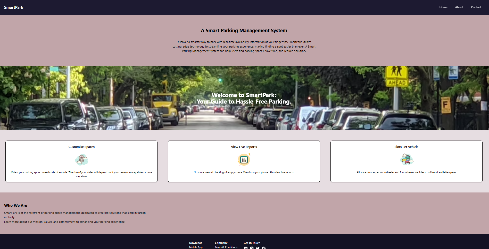
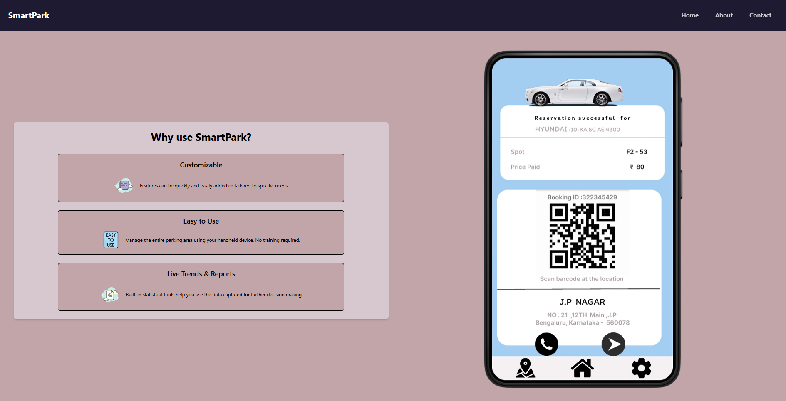
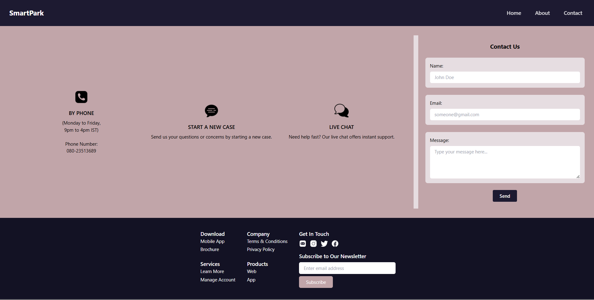

# SmartPark Web Application

## Overview

SmartPark is a web application designed to streamline parking management and enhance user experience. This project report highlights the key features and technologies used in developing the SmartPark system.

## Technologies Used

- **HTML5** for structuring web content
- **Tailwind CSS** for styling and visual presentation
- **React.js** for interactive elements and dynamic functionality
- **GitHub** for version control and collaboration

## Live Preview

Find the live webite [here](https://sourabhaprasad.github.io/smartpark/).

## Screenshots

    
     
    
     
    

## Key Functionality

- Customizability for tailored parking solutions
- User-friendly interface for ease of use
- Access to live trends and reports for informed decision-making
- Video showcase of SmartPark functionality

Feel free to explore the SmartPark project and contribute to its development!
